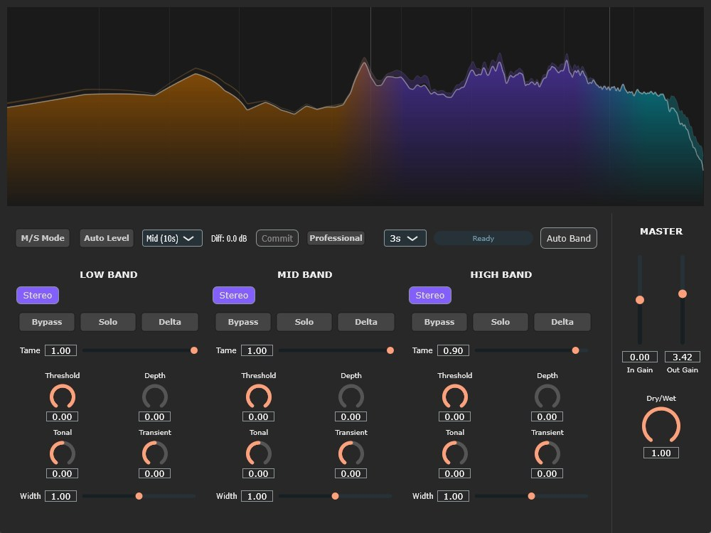
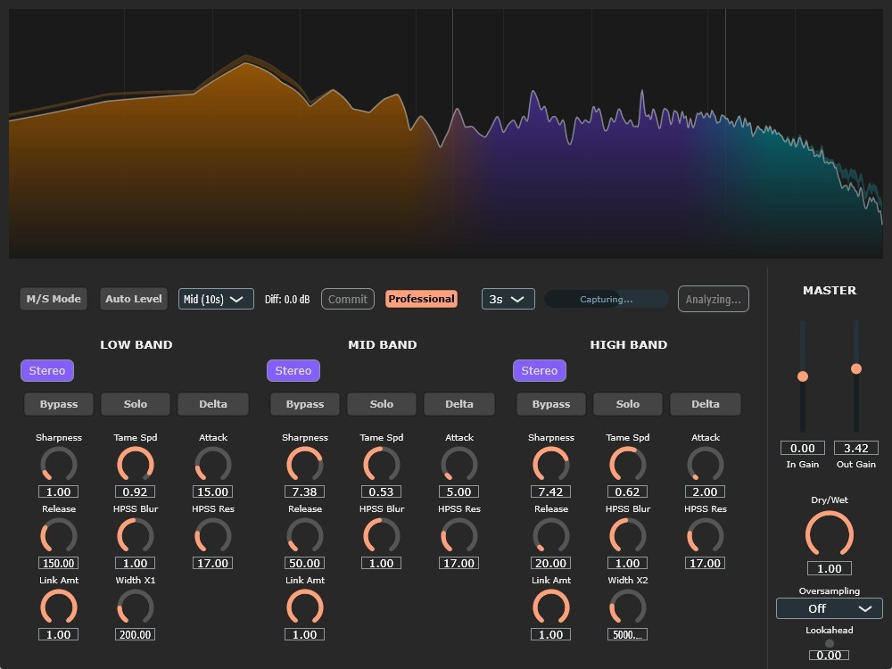

# LUMINA

##

## Overview

**LUMINA** is an open-source, next-generation Spectral Dynamics and Glitch Re-synthesizer VST3 plugin. Engineered with rigorous digital signal processing (DSP) principles and modern C++20 architecture, it provides absolute precision in resonance control, harmonic-percussive manipulation, and dynamic spatial depth for your digital audio workstation.

Rather than relying on traditional broadband dynamics, LUMINA utilizes a high-resolution Kaiser-Bessel WOLA (Weighted Overlap-Add) STFT engine combined with a 24-band Bark-scale psychoacoustic masking model to deliver zero-compromise, surgical audio processing and creative glitch capabilities.

## Key Features

### 🎛️ Psychoacoustic Spectral Taming

Intelligent dynamic suppression based on human hearing models:

* **Bark-Scale Masking Model:** Calculates real-time mutual masking thresholds across 24 critical bands to suppress only the frequencies that clash, preserving natural dynamics.
* **TPT Envelope Followers:** Utilizes Zero-Delay Feedback (ZDF) / Topology-Preserving Transform (TPT) structures for mathematically perfect, artifact-free envelope tracking.

### 🔪 HPSS & Transient Management

Deep control over the time and frequency domains:

* **Harmonic-Percussive Source Separation (HPSS):** Dual-axis median filtering separates sustain (tonal) and transient (percussive) components for independent processing.
* **Spectral Flux Onset Detection:** Highly optimized, allocation-free transient detection for extreme glitching and stutter effects without transient smearing.

### 🎚️ Precision Tone & Spatial Shaping

* **Intelligent Auto-Band:** Automatically analyzes input signals over a specified duration to set optimal crossover frequencies based on spectral valleys.
* **M/S Width & Decorrelation:** Independent Mid/Side processing with Schroeder All-Pass decorrelators and TPT Linkwitz-Riley crossovers ensuring absolute phase coherence and no latency accumulation.
* **Pro Mode Operations:** Advanced controls over HPSS Blur/Res, band-linking, and independent M/S attack/release times.
##

### 🔬 Advanced DSP Engine & Architecture

* **100% Real-Time Safe:** Absolute zero heap-allocation (`new`/`malloc`/`resize`) in the `processBlock`. All buffers (including up to 4x Oversampling and Lookahead) are pre-allocated during `prepareToPlay`.
* **SIMD Optimization:** Extreme CPU efficiency utilizing `juce::FloatVectorOperations` (AVX2/NEON) for all vector math, FFT normalizations, and windowing.
* **Host Fail-Safes (Ableton Live Ready):** Implements robust defenses against DAW-specific quirks, including asynchronous sample rate drift detection, ghost-automation prevention (`automatable = false` for trigger params), and strictly isolated lock-free SPSC queues (`juce::AbstractFifo`) for GUI-DSP communication.

### 📊 Visual & Utility Tools

* **High-Resolution Spectrum Analyzer:** 60fps smoothed visualization of Unprocessed, Tamed, and Output signals with minimal CPU overhead.
* **Auto Gain Matching:** Intelligent RMS-based gain compensation to seamlessly evaluate extreme spectral modifications without perceived loudness bias.

## System Requirements

* **OS:** Windows 10 / Windows 11 (64-bit)
* **Format:** VST3
* **Tested Host:** Ableton Live 11 / 12

*(Note: This plugin is developed and compiled exclusively for Windows architectures.)*

## Installation

1. Download the latest `Lumina.vst3` file from the [Releases]() page.
2. Move the `.vst3` file to your default VST3 plugin directory:
`C:\Program Files\Common Files\VST3`
3. Rescan your plugins in your DAW (e.g., Ableton Live).

## 📚 User Guide

A comprehensive manual covering detailed technical specifications and operational guidelines is included with this repository.

[ -red?style=for-the-badge&logo=adobe-acrobat-reader) ](./Source/Assets/LUMINA_Manual_JP.pdf)

[ -red?style=for-the-badge&logo=adobe-acrobat-reader) ](./Source/Assets/LUMINA_Manual_EN.pdf)

**Key Contents of the Manual:**

* **Detailed Section Breakdowns:** Complete explanation of all parameters across the Low, Mid, High bands and Master section.
* **HPSS & Bark Scale Guide:** Understanding the mathematical separation of tone/transient and human auditory perception.
* **DSP Specifications:** Insights into the WOLA STFT engine, TPT Crossovers, and phase-accurate decorrelation.
* **Auto Leveling & Band Learning:** Step-by-step procedures for utilizing the intelligent analysis features.

## Disclaimer & Stability

This software is provided "as-is", without any warranty of any kind.
The DSP core has been strictly engineered to prevent `NaN` generation, zero-division, and memory leaks. The architecture strictly isolates the audio thread from UI operations using lock-free structures to maintain absolute host stability (especially tailored for Ableton Live's teardown sequences) under heavy loads.

## License

This project is completely free and open-source. It is distributed under the **GPLv3 License** (due to JUCE framework standard open-source licensing). You are free to study, modify, and distribute the source code under the same terms.

## 🎓 Credits

**Developer**: @kijyoumusic (OTODESK)

**Music Production Background**: Electronic Music, Sound Design, DSP Engineering

**Target DAW**: Ableton Live 11+

**Framework**: JUCE 8.0.8

**Platform Support**: Windows 10+

---

## 📞 Support

* **Social**: [@kijyoumusic](https://x.com/kijyoumusic)

